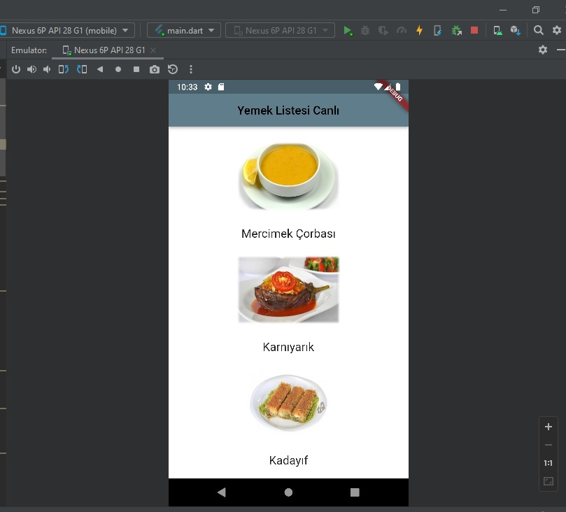

# Flutter Eğitim Serisi

Eğitim kaynağı: https://www.youtube.com/watch?v=wfhq273-EXM&list=PLJ5EAGz05Q3FJG96SH8GoWcSUg8IHwtnt&index=25

1) Proje içerisinde asset nasıl kullanılır?
   - pubspec.yaml dosyasında flutter / assets / altında kullanacağımız assetleri eklemeliyiz.
     (ardından pub get ile projeyi initiliaze etmeyi unutmayın.)

## Örnek Uygulamalar

1) Yemek Seçim Uygulaması
    -Katkıları
       StatefulWidget ile dinamik widget oluşturma,
       Buton tıklama eventı 
       Math kütüphanesi ile random sayı üretmek
       Liste tanımlamak
    Ekran Görüntüsü:
          

